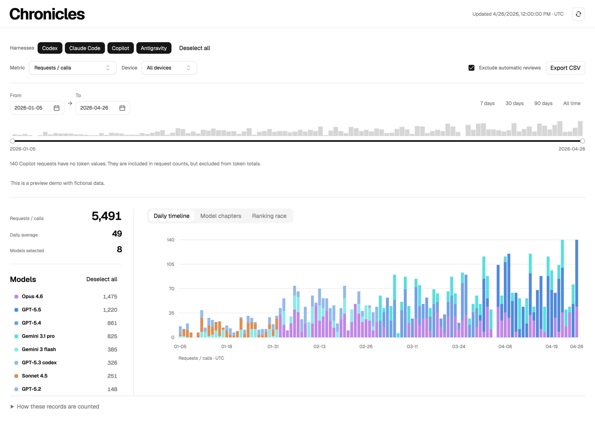
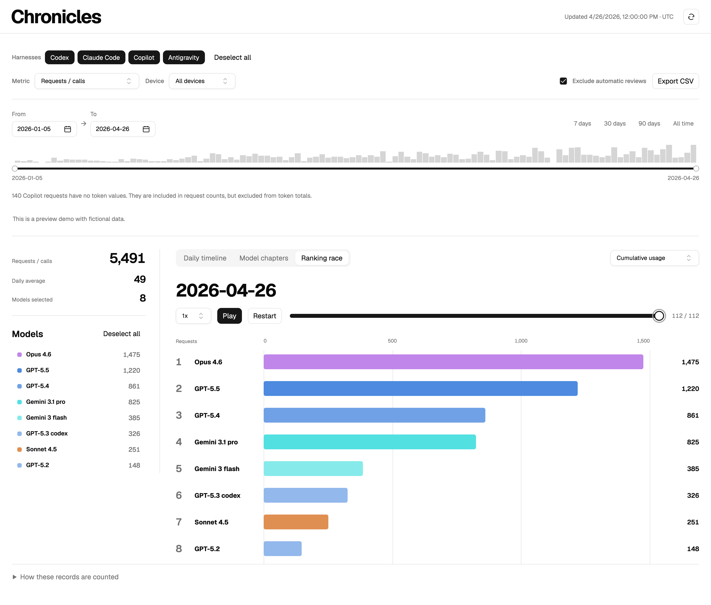

# Chronicles

**Your AI usage story across models, harnesses, and time.**

Chronicles is an open-source dashboard for exploring your AI usage history. Compare daily model usage, see when your model mix changed, and bring together records from multiple devices. It runs locally with Python’s standard library and vanilla JavaScript—no account, installation step, build process, or third-party runtime packages required.

### Daily timeline

Compare daily usage by model with stacked bars and a shared color palette.



### Model chapters

See how your model mix changes across chapters. Circle area shows total usage; bars compare daily averages.


### Ranking race

Replay model rankings over time using a 7-day window, a 30-day window, or cumulative usage. Pause, scrub to a date, and choose 1x, 2x, or 4x playback.



All screenshots use fictional demo records.

## Quick start

Requires **Python 3.10+** and a modern browser. Node.js 20+ is optional for development checks. Copilot and Antigravity discovery currently targets macOS; other adapters use their provider’s standard data locations.

```sh
git clone https://github.com/leesj-dev/Chronicles.git
cd Chronicles
python3 src/server.py
```

Open [localhost:8768](http://127.0.0.1:8768/). The first scan can take a while for large histories; later scans reuse cached files.

To explore fictional sample data:

```sh
python3 src/server.py --demo
```

If no local usage records are found, the app automatically shows a preview demo with a clear notice. Refresh checks for local records again. Demo screenshots and `examples/demo.json` contain fictional records only.

## Explore your history

- **Daily timeline:** stacked daily bars with model tooltips and shared model colors.
- **Model chapters:** ranked circles with model names directly above them. Circle area represents total usage; bars use a common scale to compare daily averages across chapters.
- **Ranking race:** animate model rankings for the selected metric and filters. Rolling windows include available history before the selected start date; cumulative usage starts at that date. At 1x, playback advances by two dates per second.
- **Filters:** select models and harnesses individually or select/deselect all. Only harnesses with loaded usage records appear; changing chart filters keeps that list stable.
- **Summary and models:** see the selected-period total, daily average, and model count beside the chart. Toggle models from the list; on small screens, the panels stack vertically.
- **Numbers:** request counts stay unabridged (for example, `11,680`), and request averages use at most one decimal place. Abbreviated token values use two decimal places (for example, `130.50M`).
- **Metrics:** requests/calls, total/input/output tokens, cache read/write, and Copilot response rounds. All visualizations use the same metrics and colors.
- **Date range:** drag either endpoint, choose dates in the calendar popovers, or choose a preset. Calendars support month navigation and keyboard selection and disable dates outside the available or selected range.
- **Chapter boundaries:** model transitions, 7-day intervals, or calendar months.
- **Export CSV:** exports the current selection; missing token counts remain blank.
- **Appearance:** automatically follows system light/dark mode.

Transition chapters begin when a new model appears with at least 3 records and 0.5% of selected requests. Boundaries stay at least 7 days apart. Filtering recalculates chapters, and daily averages include inactive days.

## Supported sources

Native history adapters support seven harnesses:

| Harness | History source | One requests/calls unit |
| --- | --- | --- |
| Codex | `~/.codex/sessions` and `archived_sessions` | Unique token-usage report |
| Claude Code | `~/.claude/projects` | Response message carrying usage |
| Copilot | macOS VS Code `workspaceStorage/*/chatSessions` | Saved user request with a result |
| Antigravity | `~/.gemini/antigravity*/conversations/*.db` | Generation metadata record |
| Cursor | Official account usage export or imported CSV | Exported aggregate row |
| Grok | `~/.grok/sessions/**/*.jsonl` | Completed event per model |
| OpenCode | `~/.local/share/opencode/opencode*.db`, v1 and v2 tables | Completed assistant/compaction message |

`CODEX_HOME`, `CLAUDE_CONFIG_DIR`, `GROK_HOME`, `OPENCODE_DATA_DIR`, and `XDG_DATA_HOME` override their respective data locations.

### History & account limits

An optional integration with [OpenUsage](https://github.com/robinebers/openusage), the macOS app, displays account metrics for **Claude, Codex, Cursor, Antigravity, Copilot, Devin, Grok, Ollama, OpenCode, OpenRouter, and Z.ai**. Start OpenUsage and enable the providers you use. Chronicles reads its loopback API at `127.0.0.1:6736`; OpenUsage manages account authentication and polling.

Only available metrics are shown, and this panel is hidden in demo mode. Snapshots are cached for up to 30 seconds and display the upstream update time. Multi-account responses are supported. OpenUsage is optional for native history and demo mode.

Quotas, balances, and spend windows do not become dated model records. The bridge supplies no historical model ledger for Devin, Ollama, OpenRouter, or Z.ai. Ollama here refers to Ollama Cloud limits. Currency values stay separate from token and request totals.

### Cursor history

Chronicles can fetch Cursor’s official usage export using the existing app login, read from local state or the macOS `cursor-access-token` Keychain entry. History starts at January 1, 2025 by default; override with `CHRONICLES_CURSOR_START=YYYY-MM-DD`.

Normalized counters are cached for five minutes and preserved in `.local/cursor-history.json`. Credentials remain in memory and are sent only to Cursor’s HTTPS export endpoint; redirects are refused. Authentication failures retain cached history. Sign in through Cursor to renew access. Available history depends on Cursor’s export retention.

You can also place a Cursor usage CSV at `.local/imports/cursor.csv`. Overlapping automatic and manual records deduplicate.

## Timezone and other devices

Dates use the system timezone automatically (for example, `Asia/Seoul` on a Mac configured for Korean time). Chronicles checks `TZ`, `/etc/localtime`, and `/etc/timezone`, falling back to UTC if no IANA timezone is available. Restart the server after changing the system timezone. To override it, set an IANA timezone before launching:

```sh
CHRONICLES_TIMEZONE=Asia/Seoul python3 src/server.py
```

To import another device, configure an SSH host with batch authentication and Python 3.10+, then run:

```sh
CHRONICLES_TIMEZONE=Asia/Seoul python3 src/sync.py --host YOUR_SSH_HOST
```

Use the same timezone for the server and sync. Sync automatically passes this computer's resolved timezone to the remote adapters. The adapters execute over SSH without installing files remotely. Only normalized usage metadata is saved in `.local/imports/macmini.json`; conversation text and credentials are not copied. One remote snapshot is supported, and syncing another host replaces it. Duplicate local and remote records merge.

## Standalone HTML

```sh
python3 src/server.py --export exports/Chronicles.html
python3 src/server.py --demo --export exports/demo.html
```

Open the resulting file directly in a browser. All three visualizations and their filters work offline. HTML snapshots contain the complete exported record set and available account metrics; CSV exports follow the current selection. Keep personal snapshots private unless you intend to share your usage history.

## Counting and coverage

Requests/calls treats each saved unit alike for approximate usage-pattern comparisons. It does not imply equal work, compute, or billing. Copilot response rounds count saved tool-call rounds and are a separate Copilot-only metric.

Older Copilot records may preserve dates and models without tokens. They count toward requests and available rounds, never invented token totals. Legacy encrypted Antigravity `.pb` conversations are excluded and reported. Deleted or unpreserved records cannot be recovered.

Cached input stays separate from uncached input, and reasoning is not counted twice. Claude cache read/write remain separate; Copilot has no preserved cache breakdown. OpenCode’s separately stored reasoning tokens contribute to output.

## Project structure

```text
src/
  server.py          Local HTTP server, collection, and HTML export
  sync.py            Read-only SSH import
  paths.py           Source and repository data roots
  adapters/          Provider-specific history adapters and account integrations
  web/               HTML, CSS, vanilla JavaScript, and shared analytics
examples/            Fictional demo records
tests/               Analytics, adapters, collection, and export tests
docs/                Demo screenshots
.local/              Private caches and imports (gitignored)
```

Every history adapter exposes `scan() -> ScanResult`. Results contain normalized events, file counts, errors, skipped records, and coverage metadata. The collector handles date conversion, deduplication, device merging, and aggregation. Account-limit snapshots remain a separate integration.

Source assets live under `src/`; private data stays in the repository’s `.local/` directory, independent of the working directory.

## Development

No installation step is needed:

```sh
npm run check
npm test
npm run test:collectors
```

Python tests use standard-library `unittest`; JavaScript tests use Node’s built-in test runner. See [CONTRIBUTING.md](CONTRIBUTING.md) for contribution guidelines.

## Privacy and license

The server binds only to loopback, validates Host, serves an explicit asset allowlist, and uses a same-origin content policy. No analytics, external fonts, remote scripts, or conversation uploads. Private imports, exports, and Python caches are gitignored. Cursor’s optional account adapter contacts Cursor directly; other account metrics come from OpenUsage over loopback.

[MIT](LICENSE). Independent project; not affiliated with OpenAI, Anthropic, GitHub, Google, or the upstream projects. Controls derive from [shadcn-html](https://github.com/codylindley/shadcn-html) under MIT; the full notice is retained in `src/web/shadcn.css`. Nova styling follows [shadcn/ui](https://github.com/shadcn-ui/ui/blob/main/apps/v4/registry/styles/style-nova.css). Antigravity counter parsing follows the observed format described by [OpenUsage](https://github.com/robinebers/openusage/blob/main/docs/providers/antigravity.md).
