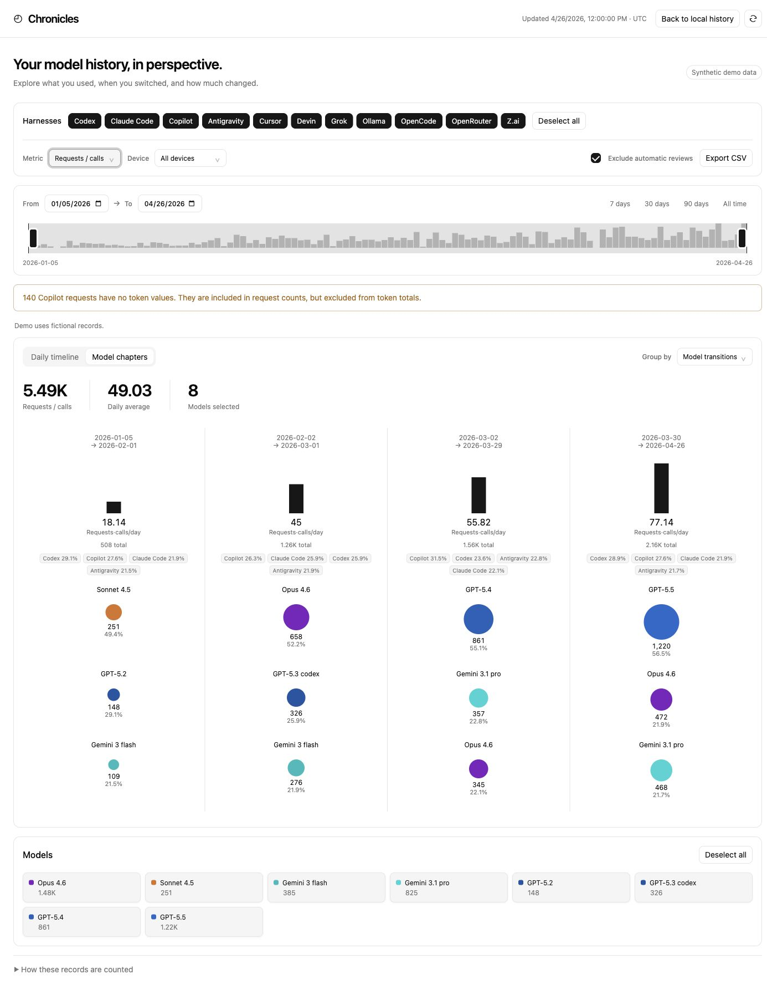

# Chronicles

**Your AI usage story across models, harnesses, and time.**

Chronicles is a local-first, open-source usage explorer with native history adapters and an optional bridge covering all 11 providers in the OpenUsage macOS app. Compare daily model usage or see how your model mix evolves across chapters. No Chronicles cloud account, build step, or third-party runtime package is required. Optional account integrations reuse the provider login you already have.

## Start

Requires Python 3.10+ and a modern browser. Node.js 20+ is optional for development checks. VS Code Copilot and Antigravity discovery currently targets macOS; Codex and Claude use their standard home directories on other systems.

```sh
git clone https://github.com/leesj-dev/chronicles.git
cd chronicles
python3 server.py
```

Open **http://127.0.0.1:8768/**. The first scan can take a while for large histories; subsequent scans cache unchanged files in memory.

For fictional sample data:

```sh
python3 server.py --demo
```

You can also switch between demo and local data in the app. Demo screenshots and `examples/demo.json` contain fictional records only.



## Explore

- **Daily timeline:** stacked daily bars with date/model tooltips, stable colors, and model multi-selection.
- **Model chapters:** ranked, directly labeled circles; area shows each model's total, with a shared scale across chapters. Common-scale bars compare daily averages. Harness shares appear directly below each chapter total.
- **Harness badges:** toggle one harness, or use Select all / Deselect all.
- **Metrics:** requests/calls, total/input/output tokens, cache read/write, and Copilot response rounds. Both views use the same filters and colors.
- **Date range:** independent start/end sliders, date inputs, and range presets.
- **Chapters:** model-transition boundaries, 7-day intervals, or calendar months.
- **Export:** CSV respects the current selection and preserves missing token values as blank cells.
- **Theme:** automatically follows your system light/dark setting.

Transition chapters use the first day of a newly appearing model with at least 3 records and 0.5% of selected requests. Boundaries stay at least 7 days apart. Filtering recalculates chapters. Daily averages include inactive days in each chapter.

## Provider coverage

The catalog matches [robinebers/openusage](https://github.com/robinebers/openusage), the macOS app: Claude, Codex, Cursor, Antigravity, Copilot, Devin, Grok, Ollama, OpenCode, OpenRouter, and Z.ai. This is a different project from the similarly named terminal OpenUsage dashboard.

| Provider                                 | Dated model history                                                          | Account metrics  |
| ---------------------------------------- | ---------------------------------------------------------------------------- | ---------------- |
| Claude Code, Codex, Copilot, Antigravity | Existing local scanners and SSH imports                                      | OpenUsage bridge |
| Grok                                     | Completed CLI turns under `~/.grok/sessions`                                 | OpenUsage bridge |
| OpenCode                                 | Read-only `opencode*.db`, both v1 and v2 tables, across all model providers  | OpenUsage bridge |
| Cursor                                   | Automatic official usage export using your Cursor login; optional CSV import | OpenUsage bridge |
| Devin, Ollama, OpenRouter, Z.ai          | No model/date ledger supplied by this bridge                                 | OpenUsage bridge |

Start OpenUsage and enable the providers you use. Chronicles reads its **read-only loopback API** at `127.0.0.1:6736` and shows text, progress, badge and trend metrics in **Sources**. The OpenUsage bridge reads no provider credentials. The separate Cursor history adapter reads the existing Cursor access token in memory and sends it only to Cursor’s official HTTPS export endpoint; it never copies credentials into reports or caches. Refresh reads cached snapshots; OpenUsage owns authentication and account polling. The bridge caches for up to 30 seconds, and each card displays the upstream fetch time. It supports old single-object and newer multi-account array responses. No OpenUsage installation is needed for native history or demo mode.

Account quotas, spend windows and balances **do not become model usage records**. The bridge does not recover missing historical model breakdowns; adding a provider to the catalog does not imply full historical token coverage. Sources renders only available account metrics; providers without metrics are omitted. Sources is hidden entirely in demo mode. Ollama here means Ollama Cloud limits, matching OpenUsage; local Ollama inference history is not reconstructed. Currency amounts remain as reported and are not mixed into token or request totals.

Cursor history loads automatically from the official dashboard export using the existing Cursor app login (local state DB, or macOS `cursor-access-token` Keychain entry). It requests history from January 1, 2025 by default; override with `CHRONICLES_CURSOR_START=YYYY-MM-DD`. Counters are cached for five minutes and preserved in ignored `.local/cursor-history.json`, with no raw CSV, account identity or credentials. Authentication failures retain previous counters and ask you to sign in again through Cursor; Chronicles does not overwrite or rotate app credentials. Redirects are refused to prevent cookie forwarding. Available history depends on Cursor's export retention.

An optional manual export at `.local/imports/cursor.csv` is also accepted. Automatic and manual overlapping rows deduplicate. CSV rows are aggregate usage records, so count comparisons are approximate.

## Timezone

Dates default to UTC. Set an IANA timezone before launching or syncing:

```sh
CHRONICLES_TIMEZONE=Asia/Seoul python3 server.py
```

`CODEX_HOME`, `CLAUDE_CONFIG_DIR`, `GROK_HOME`, `OPENCODE_DATA_DIR`, and `XDG_DATA_HOME` override their respective log roots.

## Another device over SSH

Configure an SSH host with working batch authentication and Python 3.10+ on the remote device, then run:

```sh
python3 sync.py --host YOUR_SSH_HOST
```

The scanner executes over SSH without installing files remotely. Only normalized usage metadata is copied into ignored `.local/imports/macmini.json`; conversation text and credentials are not copied. One remote snapshot is supported; syncing another host replaces it. Local and imported duplicate records are merged. Use the same `CHRONICLES_TIMEZONE` for the server and sync.

## Standalone HTML

Export an interactive snapshot with the current record set:

```sh
python3 server.py --export exports/chronicles.html
python3 server.py --demo --export exports/demo.html
```

Open it directly in a browser. Both charts, filters, and sliders work offline. The export includes normalized usage metadata and available account metric snapshots, not conversation content or credentials. Unlike CSV, its filters initially include the complete exported date range. Keep personal snapshots private if you do not intend to share your usage history.

## What counts as a record?

| Harness     | Source                                          | One requests/calls unit                |
| ----------- | ----------------------------------------------- | -------------------------------------- |
| Codex       | `~/.codex/sessions` and `archived_sessions`     | Unique token-usage report              |
| Claude Code | `~/.claude/projects`                            | Response message carrying usage        |
| Copilot     | macOS VS Code `workspaceStorage/*/chatSessions` | Saved user request with a result       |
| Antigravity | `~/.gemini/antigravity*/conversations/*.db`     | Generation metadata record             |
| Grok        | `~/.grok/sessions/**/*.jsonl`                   | Completed event per model              |
| OpenCode    | `~/.local/share/opencode/opencode*.db`          | Completed assistant/compaction message |
| Cursor      | `.local/imports/cursor.csv`                     | Exported aggregate row                 |

Requests/calls deliberately treats these units alike for approximate usage-pattern comparisons. Copilot response rounds count saved `toolCallRounds`; this is a separate Copilot-only metric. These units do not establish equivalent work, compute, or billing.

Older Copilot requests often retain model/date information without numeric token values: they count toward requests and available response rounds, never invented token totals. Legacy encrypted Antigravity `.pb` conversations are reported as excluded. Deleted or unpreserved records cannot be included. Incomplete token coverage is visible in the app.

Codex cached input is separated from input and reasoning is not added twice to output. Claude cache read/write are separate counters. Copilot does not preserve cache breakdown; those columns remain zero for measured records. Antigravity generation metadata contains input, output, and cached-read counters.

## Privacy

The server binds only to loopback, validates Host, serves an explicit asset allowlist, and uses a same-origin content policy. No analytics, external fonts, remote scripts, or conversation uploads. Cursor’s optional automatic adapter makes an authenticated HTTPS request to Cursor for your usage export; other account metrics come from OpenUsage over loopback. The API returns normalized usage metadata. Private imports, exports, and Python caches are gitignored. The repository contains synthetic sample data only.

## Development

No installation step is needed.

```sh
npm run check
npm test
npm run test:collectors
```

See [DESIGN.md](DESIGN.md) for the design direction and shared model color rules, and [CONTRIBUTING.md](CONTRIBUTING.md) for contributions.

## License

[MIT](LICENSE). Independent project; not affiliated with OpenAI, Anthropic, GitHub, Google, or the upstream projects. Controls are vendored from [shadcn-html](https://github.com/codylindley/shadcn-html) under MIT; see [THIRD_PARTY_NOTICES.md](THIRD_PARTY_NOTICES.md). Design direction references [VoltAgent/awesome-design-md](https://github.com/VoltAgent/awesome-design-md). Antigravity counter parsing follows the observed generation metadata format described by [OpenUsage](https://github.com/robinebers/openusage/blob/main/docs/providers/antigravity.md).
